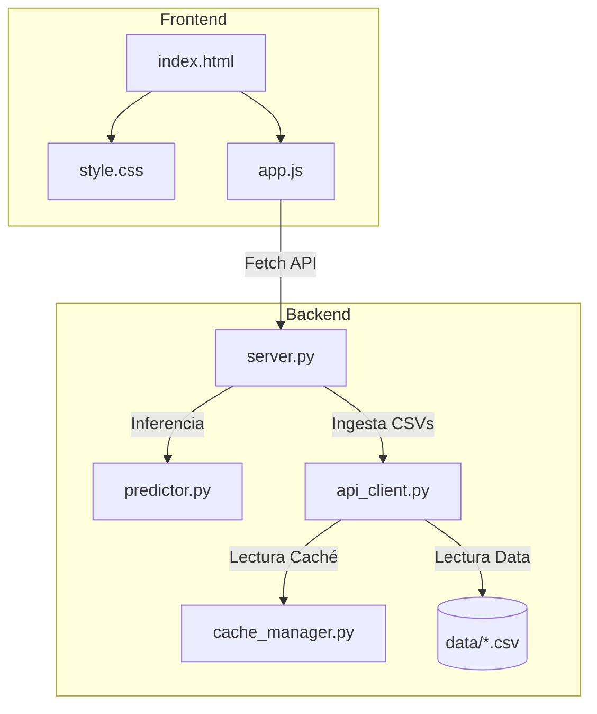

## 1. Introducción
BetIntel Plus es una plataforma avanzada de analítica predictiva de fútbol diseñada bajo una arquitectura Offline-First. Su objetivo primordial es procesar volúmenes masivos de datos deportivos históricos locales para proveer pronósticos probabilísticos de alto valor sin depender de conexiones a internet o APIs de pago en tiempo de ejecución. 

La herramienta combina modelos estadísticos rigurosos (Distribución de Poisson), un sistema de inferencia lógico (reglas expertas heurísticas basadas en datos físicos e históricos) y una interfaz de usuario interactiva y de alto impacto visual (desarrollada con tecnologías web estándar y diseño premium) para presentar las probabilidades de resultados (1X2), líneas de goles (Over/Under 2.5) y marcadores exactos.

## 2. Objetivos del Proyecto

### Objetivo General
Desarrollar y documentar un sistema inteligente de soporte a la decisión en apuestas y analítica de fútbol, que integre descubrimiento de conocimientos en bases de datos (KDD), modelado probabilístico de Poisson y un motor de inferencia experto, operando de manera 100% autónoma y sin conexión a internet.

### Objetivos Específicos
1. **Ingesta y Homogeneización Offline (KDD):** Diseñar un módulo capaz de escanear y procesar dinámicamente archivos CSV con formatos diversos (como *football-data.co.uk* y registros históricos locales), consolidándolos en una base de datos unificada en memoria.
2. **Implementación de Modelado Probabilístico:** Desarrollar un motor matemático de Poisson que genere proyecciones de goles esperados ($\lambda$) para cada equipo y construya una matriz térmica de probabilidad de $6 \times 6$ celdas para marcadores exactos.
3. **Desarrollo del Sistema Experto:** Codificar reglas heurísticas IF-THEN que analicen dinámicamente factores de inercia de goles, racha de forma de los planteles, solidez defensiva y supremacía en encuentros directos (H2H).
4. **Validación y Auditoría Retrospectiva:** Implementar un comparador predictivo que contraste los pronósticos generados con los marcadores reales de partidos finalizados, evaluando tasas de acierto exacto de marcador, tendencia 1X2 y línea de goles.
5. **Control de Consistencia Interactiva:** Modificar el flujo del simulador de partidos manual para impedir enfrentamientos incoherentes entre ligas diferentes, garantizando que el usuario solo compare equipos que comparten estadísticas de liga equivalentes.

## 3. Metodologías y Métodos Aplicados

El núcleo de BetIntel Plus descansa en tres pilares metodológicos de la informática y la estadística aplicada:

### A. Descubrimiento de Conocimiento en Bases de Datos (KDD)
El ciclo KDD se implementa en el cargador offline (`backend/api_client.py`):
1. **Selección y Limpieza:** El cargador escanea la raíz del proyecto buscando archivos `.csv`. Omite archivos vacíos, filtra filas corruptas e infiere la temporada y la liga a partir de los metadatos del archivo.
2. **Transformación:** Las fechas en formatos variados (ej: `dd/mm/yyyy` o `yy-mm-dd`) se transforman al estándar ISO `YYYY-MM-DD`. Los nombres de equipos se limpian y asocian a IDs únicos globales predefinidos (por ejemplo, *Real Madrid* $\rightarrow$ `541`) para indexar sus logos y escudos oficiales.
3. **Carga:** Todo se estructura en un arreglo JSON en memoria idéntico a las respuestas de APIs de fútbol comerciales de nivel empresarial.

### B. Distribución de Poisson para Goles Proyectados
La distribución de Poisson es un modelo de probabilidad discreto que expresa la probabilidad de que ocurra un número determinado de eventos en un intervalo de tiempo fijo. En el fútbol, se modela la cantidad de goles anotados por un equipo usando su tasa media de goles esperados ($\lambda$).

La fórmula de probabilidad para que un equipo anote exactamente $k$ goles es:

$$P(k; \lambda) = \frac{\lambda^k e^{-\lambda}}{k!}$$

Donde:
* **$\lambda$ (Lambda):** Es el promedio de goles proyectados para el equipo (Local o Visitante). Se calcula cruzando el poder ofensivo del atacante con la debilidad defensiva del oponente:
  $$\lambda_{\text{Local}} = \text{Goles Anotados Promedio}_{\text{Local}} \times \left( \frac{\text{Goles Recibidos Promedio}_{\text{Visitante}}}{\text{Promedio Goles Liga}} \right)$$
* **$e$:** Constante de Euler ($\approx 2.71828$).
* **$k!$:** Factorial de $k$.

El sistema evalúa de forma independiente $\lambda_{\text{Local}}$ y $\lambda_{\text{Visitante}}$ para valores de $k$ de $0$ a $5$ goles. Al multiplicar sus probabilidades cruzadas, se construye la **Matriz Térmica de Probabilidad de Poisson de 6x6**:
$$\text{Probabilidad Marcador}(h, a) = P(h; \lambda_{\text{Local}}) \times P(a; \lambda_{\text{Visitante}})$$

A partir de esta matriz se deducen:
* **Probabilidad 1X2:**
  * **Local (1):** $\sum_{h > a} \text{Probabilidad Marcador}(h, a)$
  * **Empate (X):** $\sum_{h = a} \text{Probabilidad Marcador}(h, a)$
  * **Visitante (2):** $\sum_{h < a} \text{Probabilidad Marcador}(h, a)$
* **Línea de Goles (Over/Under 2.5):**
  * **Under 2.5:** Suma de probabilidades de celdas $(0-0, 1-0, 0-1, 1-1, 2-0, 0-2)$.
  * **Over 2.5:** $1.0 - \text{Under 2.5}$.

### C. Motor Experto de Reglas Heurísticas (Inferencia Lógica)
Una vez que el modelo matemático puro de Poisson arroja las probabilidades base, el **Motor de Inferencia** (`backend/predictor.py`) aplica heurísticas cualitativas para ajustar las predicciones y generar veredictos enriquecidos:

1. **Inercia Over (H2H):**
   * *Regla:* IF el historial H2H directo promedio supera los $2.8$ goles por partido, THEN se incrementa la probabilidad de Over en $+15\%$.
2. **Duelo Ofensivo Abierto:**
   * *Regla:* IF ambos equipos tienen un estado de forma reciente (puntos en últimos 5 partidos) $\ge 75\%$, THEN se asume un partido abierto y se ajusta la línea de goles en $+10\%$ Over.
3. **Cerrojo Defensivo:**
   * *Regla:* IF la solidez defensiva del local y del visitante es $\ge 75\%$ (pocos goles recibidos), THEN se disminuye la probabilidad de Over en $-15\%$ (se penaliza el flujo goleador).
4. **Supremacía Local H2H:**
   * *Regla:* IF el local ha ganado el $\ge 66\%$ de los H2H históricos (mínimo 3 partidos), THEN se activa una regla de alerta que favorece la predicción del signo local.

### D. Auditoría Predictiva Retrospectiva
Para los partidos marcados como finalizados (`FT`), el sistema contrasta los datos reales con los calculados previamente por Poisson:
* **Acierto Marcador Exacto:** Compara si el marcador real coincide exactamente con la celda de máxima probabilidad en la matriz.
* **Acierto Tendencia (1X2):** Evalúa si el equipo ganador real coincide con la predicción de signo (Local, Empate o Visitante).
* **Acierto Goles:** Compara si el total de goles real y el pronosticado están en el mismo lado de la línea de 2.5.
* **Desviación de Goles:** Calcula la distancia absoluta entre el promedio proyectado ($\lambda_{\text{Local}} + \lambda_{\text{Visitante}}$) y la suma real de goles.

## 4. Arquitectura de Módulos del Proyecto

* **`backend/server.py`:** Implementa un servidor HTTP basado en `http.server.BaseHTTPRequestHandler`. Expone los endpoints REST (`/api/fixtures`, `/api/analyze`, `/api/simulate`, `/api/teams`, etc.) y sirve los recursos estáticos del frontend.
* **`backend/api_client.py`:** El cliente de datos offline. Carga y procesa en memoria los partidos de los CSVs, simula partidos amistosos personalizados, mapea las ligas reales de España (La Liga, La Liga 2) e Inglaterra (Premier League, Championship) y proporciona logotipos reales.
* **`backend/predictor.py`:** Contiene las fórmulas matemáticas de Poisson, el generador de la matriz de celdas y el motor de inferencia con reglas de forma, defensa e H2H.
* **`backend/cache_manager.py`:** Administra un archivo caché (`api_cache.json`) que guarda resultados de análisis para evitar cálculos redundantes.
* **`frontend/index.html` & `style.css`:** Interfaz web premium de una sola página (SPA) responsiva con un esquema estético de tonos oscuros, degradados fluidos e iconos dinámicos (Lucide).
* **`frontend/app.js`:** Maneja las llamadas asíncronas, controla las pestañas activas, inicializa el simulador y actualiza dinámicamente los menús desplegables del local/visitante.

## 5. Manual del Usuario: Descripción de Secciones e Interfaz

Esta guía detalla las secciones del dashboard indicando las capturas de pantalla sugeridas para documentar la aplicación.

### A. Encabezado (Header) y Navegación
* **Qué hace:** Muestra el título del sistema ("BetIntel Plus"), el lema técnico y la barra de navegación que divide el sistema en tres pestañas principales: *Pronósticos*, *Historial General* y *Equipos y Rendimiento*.
![[Imágen 1.png]]

### B. Filtros de Liga Rápidos
* **Qué hace:** Barra de botones ubicada debajo del Header que permite filtrar todo el dashboard según la competición seleccionada: *Todas las Ligas*, *La Liga* y *Premier League* (se eliminó "Champions League" por reglas del negocio offline).
![[Imágen 2.png]]

### C. Pestaña de Pronósticos y Análisis de Partido (Principal)
Esta vista se subdivide en la barra lateral y el panel central de analítica:

#### 1. Simulador Manual (Sidebar)
* **Qué hace:** Permite simular un partido inédito seleccionando un equipo Local y uno Visitante. Cuenta con una validación inteligente: **solo es posible seleccionar rivales que pertenezcan a la misma liga**. Al cambiar el local, el visitante se filtra automáticamente (y viceversa).
![[Imágen 3.png|677]]

#### 2. Lista de Partidos Recientes (Sidebar)
* **Qué hace:** Lista cronológica de los partidos contenidos en la base de datos para la fecha activa. Muestra el estado del partido ("Finalizado")
![[Imágen 4.png]]

#### 3. Panel Central: Encabezado del Encuentro (Match Hero)
* **Qué hace:** Muestra los nombres de los dos rivales, sus logotipos a gran resolución, el estadio, la fecha y los **Goles Proyectados** (Lambdas de Poisson) para cada uno.
![[Imágen 5.png]]

#### 4. Panel Central: Auditoría del Pronóstico
* **Qué hace:** Se activa **únicamente** si el partido seleccionado ya finalizó en la vida real. Muestra el marcador real obtenido del CSV y dibuja burbujas de colores (verde para acierto, rojo para fallo) indicando si el sistema acertó el Marcador Exacto, la Tendencia 1X2 o la Línea de Goles.
![[Imágen 6.png]]

#### 5. Veredictos de Apuestas
* **Qué hace:** Tres tarjetas que resumen el veredicto en lenguaje natural: predicción del ganador (o doble oportunidad), marcador exacto más probable (con su porcentaje matemático de probabilidad) y la recomendación Over/Under 2.5 con su nivel de confianza (Alta, Moderada, Baja).
![[Imágen 7.png]]

#### 6. Gráficos de Probabilidad (1X2 y Over/Under)
* **Qué hace:** Barras de porcentaje horizontales animadas que detallan la distribución porcentual para la victoria local/empate/visita y la probabilidad de superar o no la barrera de 2.5 goles.
![[Imágen 8.png]]

#### 7. Matriz de Probabilidad de Poisson
* **Qué hace:** Tabla interactiva de $6 \times 6$ celdas (goles locales 0-5 en filas; goles visitantes 0-5 en columnas). Las celdas tienen un fondo amarillo/dorado translúcido cuya opacidad aumenta a mayor probabilidad. La celda del marcador más probable cuenta con un borde dorado brillante y un efecto de relieve.
![[Imágen 9.png]]

#### 8. Reglas del Sistema Experto y Historial H2H
* **Qué hace:** Muestra la lista de reglas cualitativas que fueron activadas por el motor de inferencia con sus respectivos porcentajes de ajuste, y el historial de los últimos 5 partidos jugados entre sí (indicando si son reales o simulados).
![[Imágen 10.png|627]]

### D. Pestaña de Historial General
* **Qué hace:** Tabla masiva que muestra todos los registros de partidos almacenados. Permite realizar búsquedas interactivas en tiempo real por nombre de equipo y filtrar por ligas. Cada fila incluye un botón "Analizar" que redirige al usuario al panel de pronóstico correspondiente.
![[Imágen 11.png]]

### E. Pestaña de Rendimiento de Equipos
* **Qué hace:** Muestra una tabla clasificatoria de rendimiento agregado, calculando partidos jugados, ganados, empatados, perdidos, efectividad porcentual global y goles promedio. Al hacer clic en cualquier fila de equipo, se despliega un **Modal Premium**.
![[Imágen 12.png]]

### F. Modal de Detalle de Equipo (Premium)
* **Qué hace:** Ventana emergente flotante que se activa al hacer clic en un equipo en la pestaña de rendimiento. Muestra un gráfico de barras verticales animado con el rendimiento del equipo a lo largo de las últimas temporadas y la lista de todos sus partidos jugados en los CSVs locales.
![[Imágen 13.png]]

### G. Footer (Pie de Página)
* **Qué hace:** Muestra la firma de la aplicación y un indicador con icono de escudo que confirma el estado activo de la base de datos offline local de BetIntel Plus.
![[Imágen 14.png]]
